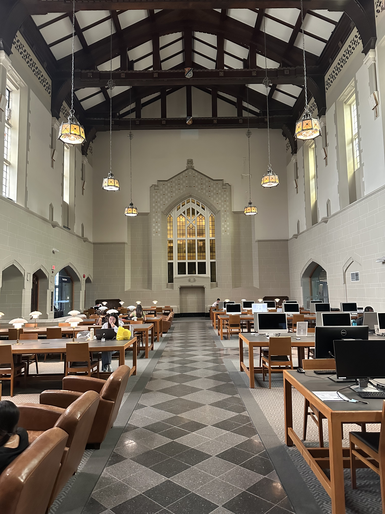

First day of orientation felt a bit overwhelming. Having so many MDS-V program students gathered in one hall room maked me feel somewhat pressured. However, the second day of orientation was much better. 

With a smaller group of only about 20 people at the Irving King library, a very peaceful and beautiful setting, giving me the chance of finally get to know my fellow CL students individually. 

At the end of the event, we received our exclusive CL backpack. It's a lululemon model I had long admired. Plus, the sandwiches on the second day were tastier than the ones from first day.